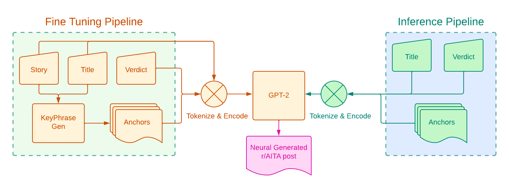
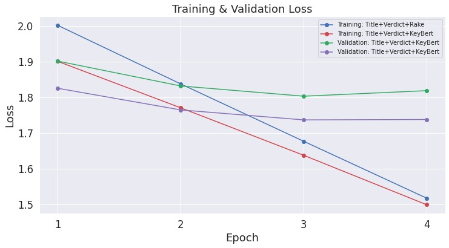
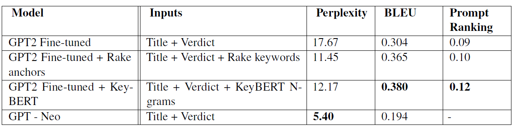

# Multi_Conditioned_Text_Generation
Conditional Text Generation using GPT-2 with multiple conditioning channels : Titles, Verdicts and Anchors. Final Project for Applied NLP at USC.

# Introduction
In this project, we attempt to improve conditioned
neural story generation. Specifically, given a title
and a verdict, the task of our neural model is to
generate a short, coherent first-person story that is
not only consistent with the title but also adheres
to the verdict. The verdict label chosen can either
be one that sheds a positive or negative light on the
narrator.

## Novel Contributions

- we propose a neural text generation system that
generates short compelling narratives conditioned
on a title,verdict pair. A verdict provides a diversifying
‘seed’ and supplements text generation with
additional context and direction.

- Additionally, we use an anchor-based
approach for gaining control and ensuring event
coherence in the generated text.

# Method

## Dataset

To power this corpus-driven application, we use
Reddit API(Reddit, 2019) to extract 121,634 posts
from r/AITA between January 1, 2014 and January
1, 2022.

In accordance with our data exploration, we perform
the following preprocessing steps:
- Retain only those posts which have more than
5 upvotes to make sure that posts and the corresponding
verdicts are meaningful.
- Retain only those posts with NTA and YTA
verdicts.
- Downsampling to balance the dataset between
the classes YTA and NTA (originally, YTA-
26%, NTA-74%).
- Retain posts with over 105 and under 596
tokens (5th - 95th percentile of word token
distribution in the dataset).

The resulting dataset consisting of 38,714 posts is
divided into two parts:
- Training Data - 37,751 posts
- Inference Data - 963 posts

Further, we use two methods to extract keyphrases
for each post:
- RAKE
- KeyBERT

## Training

The performance of the naive fine-tuning approach
falls short of expectations, mainly due to the problem
of inter-story repetition (refer to results section).
To keep event-coherence intact and to control
the flow of the story, we introduce anchors as additional
training inputs. For this fine-tuning task,
the prompt is a concatenation of the inputs Title,
Story, Verdict, Anchors for each sample. Additional
special token <eok> is used as a separator
for the anchors.
  

# Experimental Setup
  
  ## Training Setup
  We fine-tune GPT-2 (with 117 million parameters)
and generate stories using top-k (with k=50)
and top-p (with p=0.95) sampling (Holtzman
et al., 2019). We find this sampling method
more effective at producing diverse phrases
than beam-search. GPT-Neo (with 1.5 billion
parameters) is fine-tuned on TPUEstimator with
the GELU (Gaussian Error Linear Unit) activation
function.
  
  ### Training Parameters:
  - Learning Rate : 5.0e-04
  - Sequence Length : 800
  - Device : GPU
  - Epochs : 4
 
  

  # Evaluation
  ## Evaluation Protocols Used
  - Perplexity
  - BLEU Score
  - Prompt Ranking
  
  # Results and Discussion
  ## Results
  We analyze the effects of our modeling improvements
through the introduction of anchors on the inference dataset.
  
  
  
  ## Discussions
  
  ### Generation Quality
  
  Our proposed anchor based model exhibits the capability
of producing unique stories that follow
a similar language to the posts made on the particular
subreddit, characterized by a personal and
accusative tone. Many of the posts made on the
subreddit r/AITA also have this accusative tone
and are usually an attempt to absolve oneself from
blame. A reduction in perplexity score from the
baseline is indicative of this. However, the model
has its drawbacks which we elaborate below.
  
  ### Inter-Story Repetition
  
  The anchor-based models demonstrate that additional
context grounding through the use of
keyphrases alleviates some inter-story repetition.
Despite this, as the maximum length of a story
grows, the amount of inter-story repetition grows
proportionally.
  
  ### Performance Compared to Bigger
Models
  Despite fine-tuning and additional context from anchors,
GPT-2 based models do not outperform bigger
pre-trained models (such as GPT-3, GPT-Neo
with billions of parameters). The bigger pre-trained
models are generally able to write stories that exhibit
more likeness to reddit language, indicated by
a significantly low perplexity. They also write stories
that are better in terms of diversity, observable
from a lower BLEU score.
  
# Conclusion and Future Work
  
  In this project, we explore conditioned automatic
story generation in the context of reddit posts. We
propose and explore two anchor-based approaches
in addition to simple fine-tuning of pre-trained models
to achieve better event-coherence in the generated
stories.
Our current fine-tuning approach lacks commonsense
awareness. In the future, we plan to explore
better common sense grounding techniques. It can also be noted that a generative
task such as ours is faced with a lack of sophisticated
automatic evaluation metrics. As an extension,
we plan to include human evaluation metrics
such as the triplet pairing task. Finally,
we hope to try more sophisticated key-phrase
extraction and topic modeling approaches to improve
the quality and diversity of the anchors.
  
